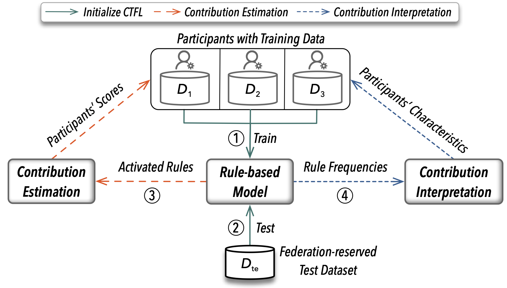

# Contribution Tracing for Federated Learning (CTFL)

CTFL is a fast, accurate, robust and interpretable contribution estimation system, as described in the paper.

<p align="center">
  
</p>

* CTFL estimates participants' contributions efficiently and accurately by tracing the test performance gain using rule-based models. 
* Additionally, CTFL ensures fair and rational estimations by satisfying essential theoretical properties.
* Moreover, CTFL achieves robust estimations by employing judiciously designed contribution allocation schemes. 
* Furthermore, CTFL interprets participants' contribution scores and provides insightful characteristics into each participant.
* Finally, CTFL is implemented by a practical rule-based model using logical neural networks and binarization techniques.

## Environment Setup

Install Python dependency via `pip install -r requirements.txt` when the environment of Python is set up.


## Directory Layout

    .
    ├── main                  # CTFL code demo entrance  
    ├── train                 # Rule-based model training and test
    ├── ours/ctfl             # Contribution estimation process by CTFL
    ├── ours/implementation   # Rule-based model implementation for CTFL
    ├── ours/components       # Model implementation components for CTFL
    ├── interface             # Abstract contribution estimation interface  
    ├── data                  # Training and test data files 
    ├── dataprep              # Data preprocessing and loaders 
    ├── util/config           # Global configuration settings 
    ├── util/args             # (Hyper-) parameters for running CTFL
    ├── utils/logger          # Information logger  
    └── logs                  # CTFL model training and test logging files

## Running Example 

The audience can directly run `python main.py` for a participant contribution estimation demo on the `tic-tac-toe` dataset.

## Expected Output

```
Frequent rules learned from training data are as follows:
RID	Negative(-)/Postive(+)	Support	Rule
9	+	1_x & 2_x & 3_x
6	-	1_o & 2_o & 3_o
0	+	2_x & 5_x & 8_x
12	+	1_x | 5_x | 9_x
3	+	7_x & 8_x & 9_x
5	+	1_x & 4_x & 7_x
16	-	3_o | 5_o | 7_o
7	+	3_x & 6_x & 9_x
15	-	1_o | 5_o | 9_o
11	+	4_x & 5_x & 6_x


Participants' contribution scores by CTFL_micro, in descending order
PID-5, score = 0.36
PID-3, score = 0.25
PID-2, score = 0.12
PID-4, score = 0.11
PID-6, score = 0.06
PID-0, score = 0.05
PID-7, score = 0.04
PID-1, score = 0.03

Contribution estimation time cost is 20 seconds
```

